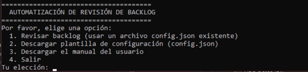
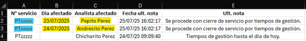

🤖 Herramienta de Revisión de Backlog 🤖
¡Automatiza la auditoría de tus tickets y recupera tu tiempo!

Esta herramienta de escritorio, desarrollada en Java, se encarga de la tediosa tarea de revisar el historial de tus servicios (incidentes o peticiones). Se conecta a tu plataforma, analiza las actividades y genera un informe en Excel (.xlsx) que resalta los días sin gestión y al último analista responsable.

✨ Características Principales
🖥️ Menú Interactivo en Consola: Una interfaz sencilla y fácil de usar para cualquier usuario.

⚙️ Configuración Flexible: Gestiona tus credenciales y listas de servicios a través de un archivo config.json externo.

📄 Plantillas Automáticas: ¿No sabes cómo empezar? La app genera una plantilla de configuración por ti.

📊 Reportes en Excel: Obtén un informe .xlsx claro y profesional, listo para analizar o compartir.

🌐 Gestión Automática del Navegador: Utiliza Selenium y WebDriverManager para controlar Chrome sin que tengas que configurar nada.

📖 Manual de Usuario Integrado: Descarga el manual completo directamente desde la aplicación.

📸 Vistazo a la Aplicación
<table align="center">
<tr>
<td align="center"><strong>Menú Principal</strong></td>
<td align="center"><strong>Informe Final en Excel</strong></td>
</tr>
<tr>
<td></td>
<td></td>
</tr>
</table>

🛠️ Tecnologías Utilizadas
| Java | Spring Boot | Selenium | Apache POI |
|------|-------------|----------|------------|
|  |  |  |  |

🚀 Guía de Inicio Rápido
¡Empezar es muy fácil! Sigue estos 5 pasos:

Requisitos: Asegúrate de tener Java 17 o una versión superior instalada en tu sistema.

Descargar: Ve a la sección de Releases de este repositorio y descarga el último archivo .jar.

Ejecutar: Haz doble clic en el archivo .jar para abrir el menú en la consola.

# O ejecútalo desde la terminal
java -jar nombre-del-archivo.jar

Obtener Configuración: Usa la Opción 2 del menú para descargar la plantilla config.json.

¡A Automatizar!: Edita el archivo config.json con tus datos y, a continuación, usa la Opción 1 para iniciar la revisión.

📖 Documentación Completa
Para una guía detallada sobre cada paso, configuración y solución de problemas, consulta el manual de usuario completo.

➡️ Leer el MANUAL_DE_USO.md

🤝 ¿Quieres Contribuir?
¡Las contribuciones son bienvenidas! Si tienes ideas para mejorar la herramienta o encuentras un error, no dudes en abrir un "Issue" o enviar un "Pull Request".

➡️ Guía para Contribuidores (CONTRIBUTING.md)

⚖️ Licencia y Descargo de Responsabilidad
Este proyecto se distribuye bajo la Licencia MIT. Para más detalles, consulta el archivo LICENSE.

Importante: Esta herramienta se proporciona "tal cual", sin garantías de ningún tipo. El uso de este software es bajo tu exclusiva responsabilidad. El desarrollador no se hace responsable de ningún daño, bloqueo de cuentas o cualquier otra consecuencia derivada de su uso.

Desarrollado con ❤️ por Stally Ortega

